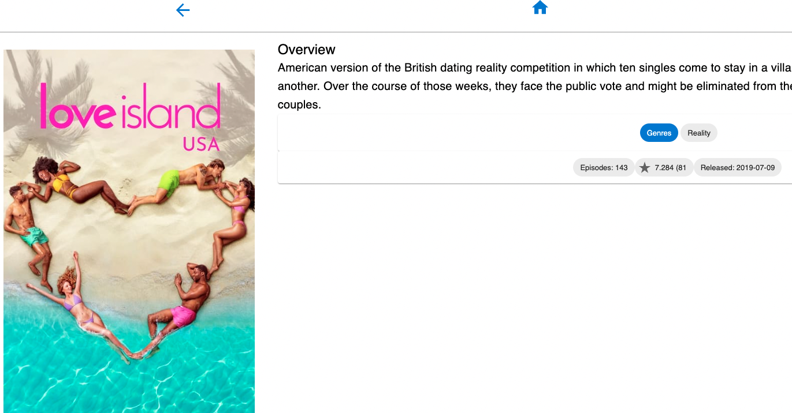

# Full Stack Development 2 - Assignment.

__Name:__ Conor O'Malley

## Features.

+ Now Playing Movies Page
+ Top Rated Movies Page
+ Popular TV Shows Page & TV Show Details Page
+ Fantasy Movies page
+ 4 additional static routes & 3 parameterised routes
+ Additional TV Series entity type
+ Full caching
+ Additional filtering to include 'Average Vote' option
+ Fantasy record form with runtime storage of entries
+ Data Hyperlinking
+ Private & Public Routing (Fantasy Page is private requiring Login)
+ Storybook support

## Feature Design.

#### Now Playing Movies.

> Lists movies from the Now Playing movies endpoint of TMDB.

#### Top Rated Movies.

> Lists movies from Top Rated movies endpoint of TMDB.

#### Popular TV Shows.

> Lists TV Shows from the Popular TV Shows endpoint of TMDB.

#### TV Show Details.

> Shows the details of the selected TV Show.

#### Fantasy Movies.

> Provides a web form to add a fantasy movie entry.

#### 'Average Vote' Filtering.

> User an also filter by the Average Vote.

## Storybook.

> Movies Card 

> TV Show with sample data. 

## Authentication

#### Private routes 

+ /movies/favourites
+ /movies/:id
+ /reviews/:id
+ /movies/upcoming
+ /movies/nowplaying
+ /movies/toprated
+ /tvshows
+ /tvshow/:id
+ /login
+ /fantasy (Private - requires authentication)

#### Protected functionality. (if relevant)

Only authenticated users can use the fantasy page to add a movie.